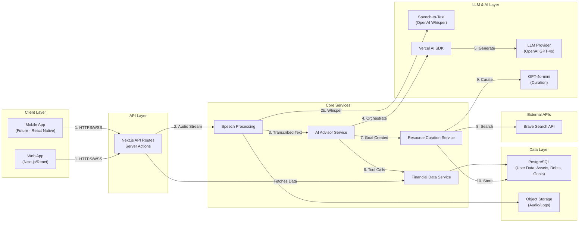

# Architecture Design: AI Personal Finance App

## Goal
Build a scalable, production-ready prototype of a personal finance web application that features a speech-first AI advisor and a dynamic dashboard. The system is designed to be mobile-ready and secure.

Note: Require Brave Search API Key and OpenAI API Key

## Architecture Diagram




## Technical Stack & Rationale

### 1. Frontend: Next.js (React) + Tailwind CSS
*   **Why:** Next.js provides a robust framework for both static and server-rendered content, essential for performance and SEO. It allows us to build the API layer directly within the same project for the prototype phase while keeping it modular enough to separate later.
*   **Styling:** Tailwind CSS allows for rapid, consistent styling that can easily be adapted to a "premium" aesthetic with custom configurations.
*   **State Management:** React Context or Zustand for managing complex local state (chat history, dashboard data).

### 2. Backend: Next.js API Routes (Serverless/Edge)
*   **Why:** Simplifies the stack for the prototype. We will use a "Service Layer" pattern to ensure business logic is decoupled from the HTTP transport layer. This makes it easy to migrate to a dedicated Node.js/NestJS microservice later if needed for the mobile app.
*   **Real-time:** We can use Vercel AI SDK for streaming LLM responses to the client, giving a snappy "speech-like" feel. Vercel AI SDK is built by the creators of Next.js, and it has pre-built React hooks and unified stream protocol to abstract away the differences between LLM providers.

### 3. Database: PostgreSQL + pgvector
*   **Why:** Financial data requires strict ACID (Atomicity, Consistency, Isolation, Durability) compliance and relational structure (Users -> Accounts -> Transactions). PostgreSQL is the industry standard.
*   **AI Context:** By using the `pgvector` extension, we can store embeddings of conversation history and financial documents in the *same* database, reducing infrastructure complexity.

### 4. LLM & Speech Integration
*   **LLM:** OpenAI GPT-4o (or latest) for high intelligence in financial advice.
*   **Speech-to-Text (STT):** OpenAI Whisper API for state-of-the-art transcription.
*   **Text-to-Speech (TTS):** OpenAI TTS or ElevenLabs for a natural voice response.
*   **Orchestration:** Vercel AI SDK. It handles the stream handling and UI state updates seamlessly.
*   **Future Evaluation:** While OpenAI is the primary model for the prototype, we will evaluate models like **Claude 3.5 Sonnet** (for complex financial reasoning) and **Gemini 1.5 Pro** (for large context analysis of bank statements) for specific background processes.

### 5. Core Services Architecture

#### 1. Speech Processing Service ("The Ears & Mouth")
This service handles all the messy mechanics of audio so the rest of the app deals with clean text.
*   **Input Handling:** It manages the microphone stream in the browser. It needs to detect when you *start* speaking and, crucially, when you *stop* (Voice Activity Detection), so it knows when to cut the recording and send it.
*   **Transcription (STT):** It sends the audio blob to OpenAI Whisper and gets back text.
*   **Synthesis (TTS):** It takes the text response from the AI and converts it back into an audio stream to play to the user.
*   **Latency Optimization:** In the future, this service would be responsible for "optimistic updates" (showing what it *thinks* you said while waiting for the final confirmation).

#### 2. Financial Data Service ("The Ledger")
This is the boring, strict, mathematical heart of the app. It does *not* use AI. It is deterministic.
*   **CRUD Operations:** It is the only thing allowed to write to the `users`, `assets`, and `debts` tables.
*   **Aggregation:** If the dashboard needs "Total Net Worth," this service runs the math (`Assets - Debts`). It ensures we don't have calculation errors scattered across the frontend.
*   **Validation:** It enforces rules like "A bank account balance cannot be `NaN`" or "A transaction date cannot be in the future."
*   **Security:** It checks "Does User A have permission to view Account B?" before returning any data.

#### 3. AI Advisor Service ("The Brain")
This service acts as the bridge between the user's intent and the hard data.
*   **Orchestration:** It receives the text from the Speech Service. It decides: "Is the user asking a question? Or telling me to update their salary?"
*   **Context Management:** It pulls relevant history from the Vector DB (e.g., "The user mentioned they want to buy a house last week").
*   **Tool Calling:** If the user says "Update my savings to $50k", the AI Advisor doesn't write to the database directly. It calls a function exposed by the Financial Data Service (`updateAssetValue(userId, 'savings', 50000)`).
*   **Persona:** It maintains the "Friendly Financial Expert" personality, ensuring the tone is encouraging rather than robotic.
*   **Evaluation - Two Modes:** We are evaluating splitting this into two modes:
    *   **Foreground (Fast):** <1s latency for maintaining conversational flow.
    *   **Background (Reconciliation):** A slower, asynchronous process that analyzes conversation history to resolve contradictions.

#### 4. Resource Curation Service ("The Librarian")
This service curates high-quality resources for each goal step using a two-LLM pipeline:

```
┌─────────────────────────────────────────────────────────────────┐
│  LLM CALL #1: Intent Extraction                                 │
│  ─────────────────────────────────────────────────────────────  │
│  Input:  Step description + Goal context                        │
│  Output: Intent Spec (userJob, constraints, resourceTypes,      │
│          queryTerms)                                            │
│  Model:  gpt-4o-mini                                            │
└─────────────────────────────────────────────────────────────────┘
                              ↓
              queryTerms sent to Brave Search API
                              ↓
                    candidate URLs returned
                              ↓
┌─────────────────────────────────────────────────────────────────┐
│  LLM CALL #2: Resource Curation                                 │
│  ─────────────────────────────────────────────────────────────  │
│  Input:  Candidate URLs + Intent Spec (for context)             │
│  Output: 5-8 curated resources with guardrails enforced         │
│  Model:  gpt-4o-mini                                            │
└─────────────────────────────────────────────────────────────────┘
```

*   **Intent Extraction (LLM #1):** Converts step descriptions into structured intent specs with search queries.
*   **Web Search:** Searches Brave API with generated queries, 2-year recency filter.
*   **Candidate Filtering:** Removes spam, duplicates, enforces HTTPS.
*   **LLM Curation (LLM #2):** Selects 5-8 resources with guardrails:
    *   Hard URL constraint (only from candidate set)
    *   Diversity rule (3+ publishers, 2+ resource types)
    *   Quality prioritization (.gov, .edu, FINRA, NerdWallet, etc.)
*   **Async Execution:** Runs in background after goal creation, doesn't block conversation.

**Summary:**
*   **Speech Service** translates Sound <-> Text.
*   **Advisor Service** translates Intent <-> Action.
*   **Financial Service** translates Action <-> Database Rows.
*   **Resource Service** translates Goal Steps <-> Curated Resources.

## Key Data Flows

### A. The "First Consultation" (Speech-First)
1.  **Input:** User speaks into the microphone.
2.  **Processing:** Audio blob sent to API -> Whisper -> Text.
3.  **Reasoning:** Text sent to LLM with system prompt ("You are an expert financial advisor...") and *current known state*.
4.  **State Reconciliation (Background Process):**
    *   A secondary "State Manager" LLM call analyzes the full conversation history (or the latest diff).
    *   It resolves conflicts (e.g., User: "My debt is 5k" -> "Actually, make that 6k").
    *   It updates the "Structured Financial Profile" (Net Worth, Goals, Debt) only when confident.
5.  **Storage:**
    *   Full transcript saved to Object Storage/DB.
    *   Consolidated Structured Data saved to PostgreSQL tables (`goals`, `assets`).
    *   Conversation embeddings saved to Vector Store for future context.
6.  **Output:** LLM text response -> TTS -> Audio played back to user.

### B. The Dashboard
1.  **Data Fetch:** Frontend requests aggregated data from `Financial Data Service`.
2.  **Visualization:** Charts (Recharts/Visx) render the structured data extracted during the consultation.

## Security & Best Practices
*   **Compliance & Data Privacy:** To satisfy requirements like SOC2 or GDPR, we will implement encryption at rest (DB) and in transit (TLS), comprehensive audit logging for all AI and financial actions, and strict Row Level Security (RLS) to ensure users can only access their own data.
*   **Sanitization:** LLM outputs are sanitized to prevent injection attacks.
*   **Authentication:** Secure session management via Clerk or NextAuth.
